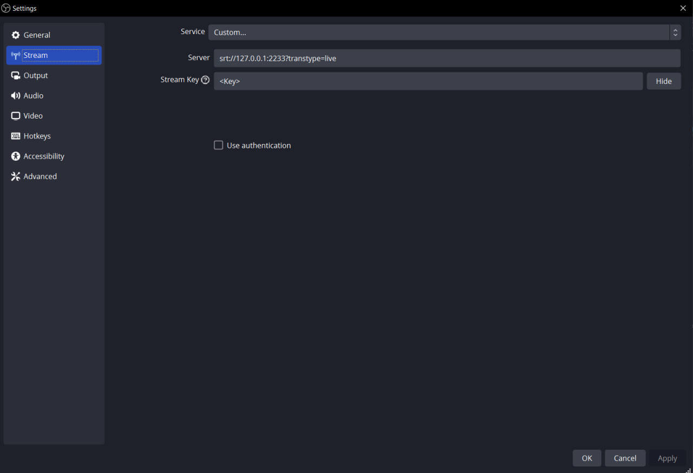
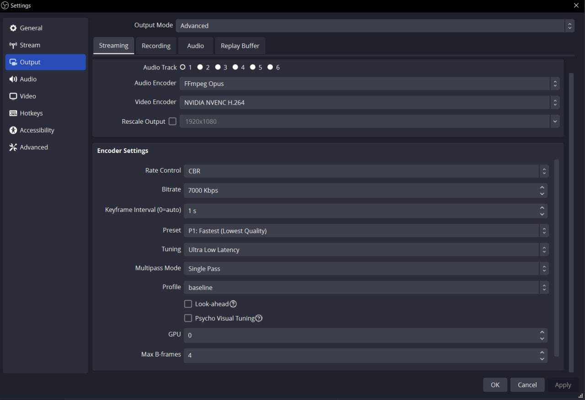
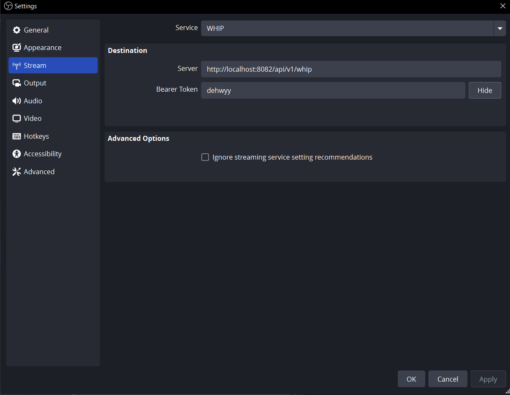
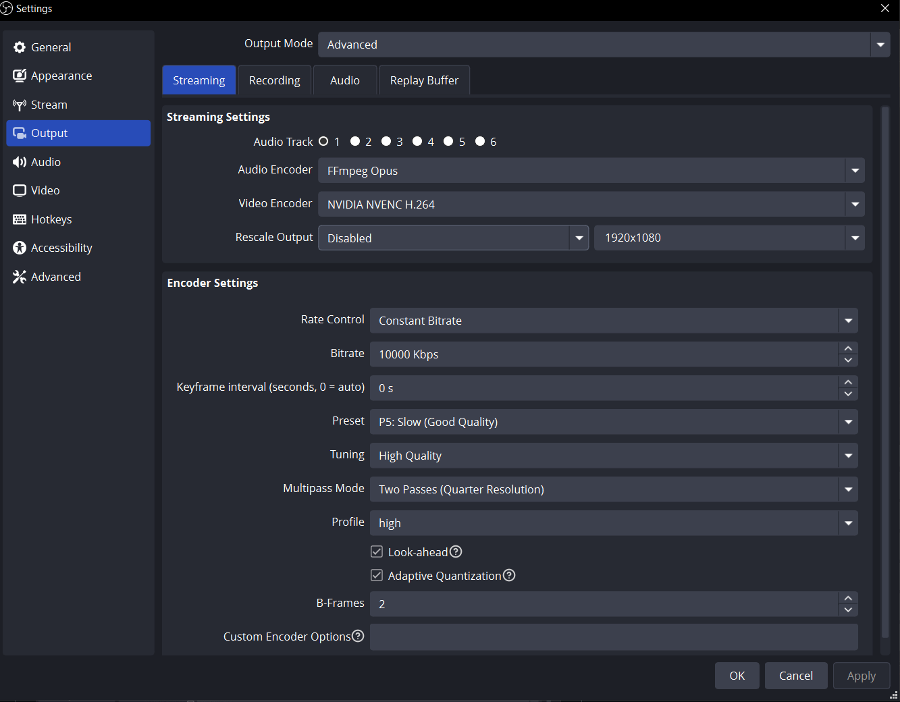
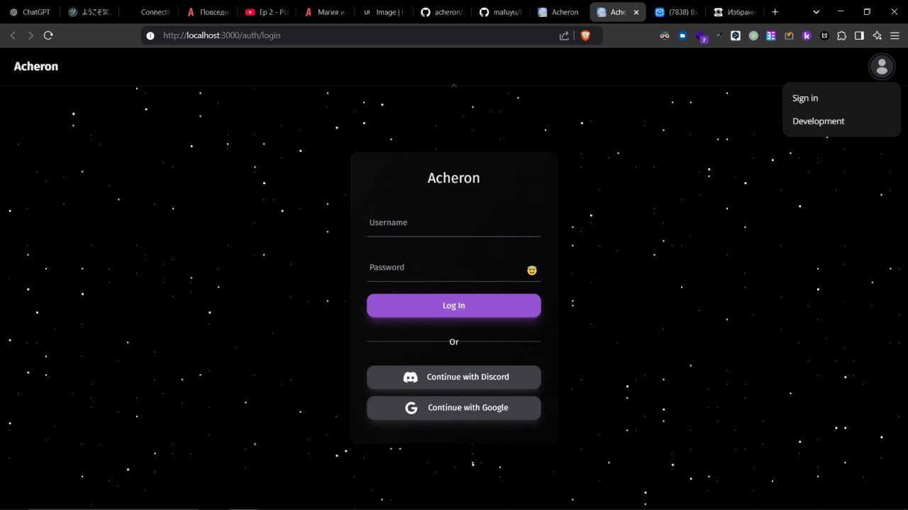
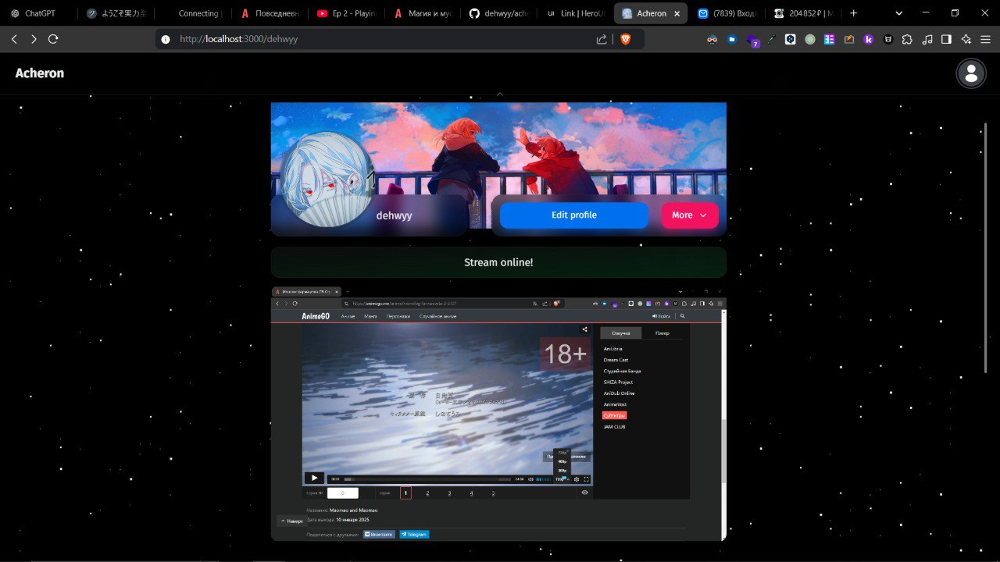

# Acheron

## Streaming
Stream can be started using OBS.

There're 2 types of streaming:
1. ***SRT*** - at least 2 seconds latency -> Useful for wide-broadcast - **similar to twitch**.
2. ***WebRTC(Whip)*** - very low-latency as connection established P2P -> **similar to discord**.

- Tested on my PC.
- No lags.
- No freezes.
- High quality (there are limitations, I guess).
- ***120***  FPS.
- (SRT) ***Use FFmpeg AAC as audio encoder!*** . Otherwise audio won't work! *P.S.* on **2nd** screenshot other codec is set.
- (Whip) ***Use FFmpeg Opus audio encoder.***

### OBS SRT Stream Settings

### OBS SRT Output Settings

## OBS Whip Stream Settings

### OBS Whip Output Settings

## App screenshots

### Auth page

### User page (not dedicated for watching streams)
z

### StreamHost service
- Responisible for handling data passed by SRT connection from OBS.
- Recommended `SegmentDuration`=1000 (ms) and `SegmentsPerStream`>=10 (via `config/config.toml`)
